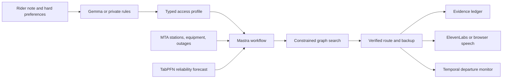

# AccessPath

AccessPath is an evidence-first journey planner for riders who depend on step-free transit. It checks the infrastructure a route needs, shows the source behind each access claim, and calculates a backup when a lift failure invalidates the original trip.

The working demonstration plans a trip from Grand Central-42 St to Astoria Blvd. Its original route changes at Queensboro Plaza. A clearly labelled simulated transfer-lift outage blocks that interchange, so the planner finds a second route through Times Sq-42 St without relaxing the rider's step-free requirement.

## Why this project exists

Most route planners treat accessibility as a filter attached to a station. A wheelchair user needs a stronger answer. The station entrance, platform, direction of travel, transfer path, and the equipment serving them all have to work at the same time.

AccessPath was built for my sibling, who needs that whole chain to be visible before leaving home. It follows three rules:

- A hard access requirement is never traded for a shorter arrival time.
- A prediction, simulation, or stale snapshot must be labelled as such.
- An AI model may interpret a rider's words and explain a result, but public evidence and deterministic graph search choose the route.

## What works now

- 496 NYC Subway stop records and 1,000+ travel and interchange edges derived from official GTFS and station data
- live, replay, and labelled outage-simulation modes
- typed Mastra workflow with five observable planning steps
- local Gemma support through Ollama, with a deterministic private fallback
- constrained route search with accessible endpoints and transfers
- historical lift reliability scoring, with a TabPFN artifact loader for real model output
- source, observation time, freshness, and confidence on each recommendation
- ElevenLabs speech when configured, with browser speech synthesis as the accessible fallback
- optional MongoDB Atlas plan storage and Tiger Data evidence-event storage
- a Temporal workflow for durable pre-departure rechecks
- Sentry spans around each planning run
- responsive interface, keyboard focus states, reduced-motion support, and text equivalents for the route graphic

## Run the demo

Node 22 or later is required. On an Apple Silicon Mac without Node installed, the bootstrap script downloads a project-local Node binary.

```bash
./scripts/bootstrap-node.sh npm install
./scripts/bootstrap-node.sh npm run dev
```

Open `http://127.0.0.1:5173`. The outage demonstration runs automatically. Choose Live to ask the current MTA outage feed, Replay for a stable recorded response, or Outage demo for the reproducible Queensboro Plaza scenario.

For a normal Node installation:

```bash
npm install
npm run dev
```

The web app runs on port 5173 and proxies API requests to port 8787.

## How a plan is made



The Mastra workflow performs these operations in order:

1. Interpret the rider's note as explicit constraints.
2. Resolve live, replayed, or simulated infrastructure evidence.
3. Search the transit graph while enforcing accessible endpoints and transfers.
4. Explain the chosen route from facts already present in the result.
5. Add fresh official-domain evidence through SerpApi when configured.

Every run returns the status and duration of all five steps. The interface exposes that trace under "Inspect this run."

## Data and demonstration modes

`npm run data:sync` rebuilds the project data from these public sources:

| Source | Use |
| --- | --- |
| MTA Regular Subway GTFS | Stops, routes, stop order, and travel edges |
| MTA Subway Stations | ADA status, direction notes, coordinates, and complexes |
| MTA Elevator Equipment | Equipment identity and the paths it serves |
| MTA Elevator and Escalator Outages | Current affected stations and service paths |
| MTA NYCT Elevator and Escalator Availability | Monthly availability and unscheduled-outage history |

Replay mode is the stable judging path. Live mode attempts the current MTA endpoint and falls back to the timestamped fixture if that request fails. Scenario mode adds one local record with `simulated: true`; the UI and evidence ledger use the simulation label everywhere it appears.

## Open-source AI at the core

The application does useful work with no closed model API. Mastra, an open-source workflow framework, runs the planning pipeline. Gemma can run through a local Ollama instance, so a rider's free-text access note does not have to leave infrastructure they control.

The model has a deliberately narrow job. It converts a note such as "I use a wheelchair and need a reliable, step-free transfer" into typed preferences, then writes a short explanation of a route that the graph engine has already verified. It cannot mark a station accessible, suppress an outage, or invent a transfer.

If Ollama is unavailable, explicit checkboxes and a small local rule set preserve the same hard constraints. That fallback keeps the demo usable while making the active execution path visible.

## TabPFN forecast

[`ml/train_tabpfn.py`](ml/train_tabpfn.py) fetches public monthly MTA equipment history, creates lagged availability and outage features, and uses a chronological 80/20 split. It compares TabPFN with a histogram gradient-boosting baseline, then writes two files after a real authenticated TabPFN run:

- `ml/reports/tabpfn-evaluation.json`, containing the split, row counts, metrics, and timings
- `data/processed/tabpfn-reliability.json`, containing station-complex risk forecasts consumed by the route engine

The script exits without writing a TabPFN artifact when no token is present. This prevents a baseline estimate from being presented as partner output.

```bash
python3 -m venv .venv-tabpfn
source .venv-tabpfn/bin/activate
pip install -r ml/requirements.txt
TABPFN_TOKEN=... python ml/train_tabpfn.py
```

## Tinker fine-tune

[`training/tinker_finetune.py`](training/tinker_finetune.py) trains a rank-16 LoRA adapter on a small accessibility-note extraction set. Four examples are held out. The script evaluates the base model, performs 12 supervised updates through Tinker, reevaluates the same holdout, and writes exact-match, field-accuracy, loss, and latency data to `training/reports/tinker-evaluation.json`.

```bash
python3 -m venv .venv-tinker
source .venv-tinker/bin/activate
pip install -r training/requirements.txt
TINKER_API_KEY=... python training/tinker_finetune.py
```

The evaluation file is the required proof for entering the Tinker category. Do not claim the category from the presence of a training script alone.

## Partner integrations

The health endpoint and the interface report `live`, `configured`, or `fallback` for every integration. The default clone has no private keys, so only local and public-data components report live.

| Technology | Responsibility | Proof in this repository |
| --- | --- | --- |
| Gemma | Private preference interpretation and route explanation | `server/services/gemma.ts`, DigitalOcean Ollama cloud-init |
| Mastra | Typed evidence-to-route workflow | `server/workflow.ts` |
| TabPFN | Station-complex lift-risk forecast | `ml/train_tabpfn.py`, artifact loader in `server/data-store.ts` |
| Tinker | LoRA training for access-note extraction | `training/tinker_finetune.py`, held-out dataset |
| Backboard | Open-model comparison on one fixed extraction benchmark | `scripts/benchmark-backboard.ts` |
| ElevenLabs | Spoken journey briefing | `POST /api/voice` and the interface audio control |
| Temporal | Durable live rechecks and route-change recording | `server/temporal/` and `POST /api/monitor` |
| MongoDB Atlas | Expiring journey-plan history | `server/persistence.ts` |
| Tiger Data | Timestamped evidence-event history | `server/persistence.ts` |
| Sentry | Trace around the agent workflow and exception capture | `server/app.ts` |
| SerpApi | Fresh destination evidence restricted to official results | `server/services/serpapi.ts` |
| Render | Docker web deployment | `render.yaml` |
| DigitalOcean | App deployment and private Gemma GPU runtime | `.do/app.yaml`, `deploy/digitalocean/cloud-init.yaml` |
| GitHub Actions | Automated release checks and production-image build | `.github/workflows/ci.yml` |

Judge and contributor documentation:

- [`docs/architecture.md`](docs/architecture.md): runtime, data, trust boundaries, and failure behavior
- [`docs/partner-evidence.md`](docs/partner-evidence.md): proof path for every genuine partner integration
- [`docs/competition-audit.md`](docs/competition-audit.md): honest category gate and simulated judging review
- [`docs/demo-script.md`](docs/demo-script.md): timed three-minute recording plan
- [`docs/PARTNER_ACTIVATION.md`](docs/PARTNER_ACTIVATION.md): credential and deployment activation order

## Test and build

```bash
npm run lint
npm test
npm run typecheck
npm run build
npm audit --audit-level=moderate
```

The test suite covers hard route constraints, the Queensboro Plaza reroute, evidence labels, all five Mastra steps, validation errors, API health, and Temporal's explicit degraded mode. The production smoke test should serve `/` and `/api/health` from the same container.

## Deploy

Build and run the same image used by Render and DigitalOcean:

```bash
docker build -t accesspath .
docker run --rm -p 8787:8787 --env-file .env accesspath
```

Render reads [`render.yaml`](render.yaml). DigitalOcean App Platform reads [`.do/app.yaml`](.do/app.yaml) after replacing the repository owner. The GPU Droplet file installs Ollama and pulls `gemma3:4b`; keep port 11434 private and point the web service's `OLLAMA_BASE_URL` at that private address.

## Safety boundaries

AccessPath is a planning aid, not an assurance that a trip will remain accessible. Equipment can fail after a check. The interface preserves operator timestamps, distinguishes current facts from predictions, and asks riders to verify critical details with the transit operator before travel.

The project stores no rider account by default. Free-text preferences stay in the running process unless MongoDB is configured. The public TabPFN training set contains aggregate equipment history and no personal data.

## Repository map

```text
src/                         React interface and accessible route visualization
server/                      Express API, planner, Mastra workflow, integrations
server/temporal/             Durable pre-departure monitoring workflow
shared/                      API and domain types
scripts/sync-data.ts         Official data ingestion and graph construction
ml/train_tabpfn.py           Reliability model and chronological evaluation
training/tinker_finetune.py  LoRA fine-tune and held-out evaluation
data/                        Reproducible processed graph and timestamped fixtures
docs/                        Submission and partner activation material
```

## License

MIT. MTA source data remains subject to its own terms.
