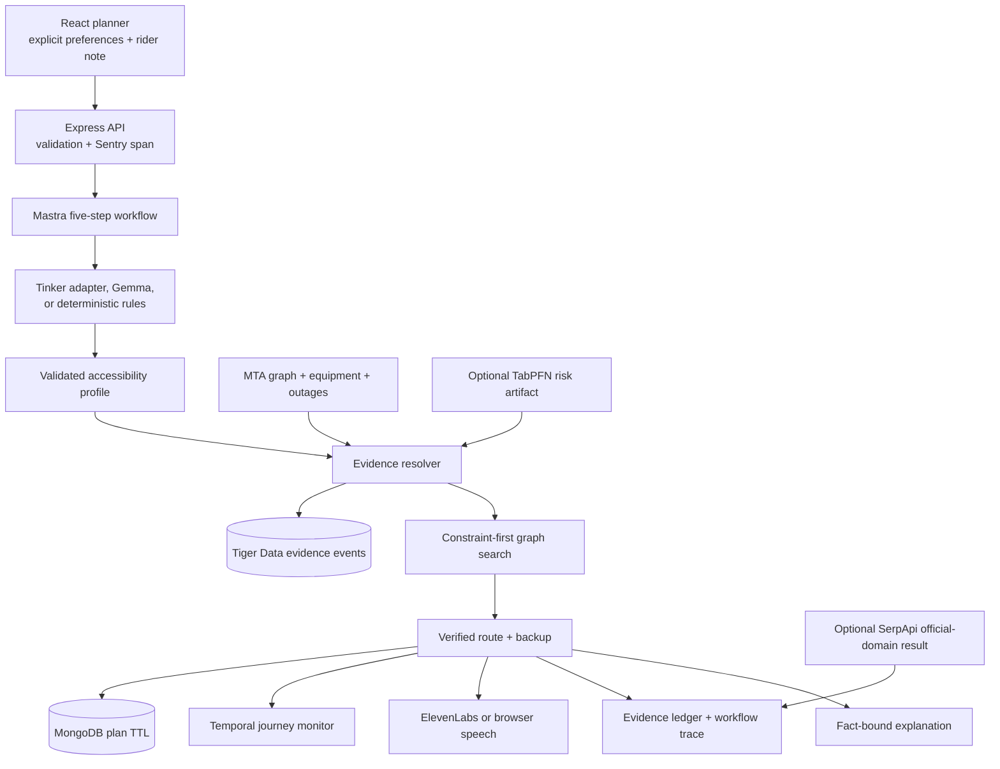

# AccessPath architecture

AccessPath separates language understanding from safety-critical route selection. Models may turn a rider's words into a typed profile and explain a completed plan. They cannot declare a station accessible, clear an outage, or relax a hard constraint. Those decisions come from official evidence and deterministic graph search.

## Runtime path

## Five workflow steps

| Step | Input | Output | Failure behavior |
| --- | --- | --- | --- |
| Interpret needs | Checkboxes and free-text note | Zod-validated access profile | Tinker → Gemma → local rules; explicit UI values are preserved |
| Resolve evidence | Mode and processed MTA data | Current, replayed, or simulated outage set | Live timeout falls back to a timestamped replay and reports fallback |
| Plan route | Profile, graph, equipment state, reliability | Recommended route and disrupted comparison | Rejects inaccessible endpoints or transfers; never softens `stepFree` |
| Explain | Already verified route facts | Short rider-facing briefing | Uses a deterministic fact-bound template if Gemma is absent |
| Enrich evidence | Destination and official domains | Optional fresh search record | Omits the result if no verified official-domain record is returned |

Every step emits a state, duration, and detail. The interface exposes these values under **Inspect this run**.

## Data pipeline

`npm run data:sync` downloads and normalizes five public MTA sources:

1. regular Subway GTFS for stops, lines, order, and travel edges;
2. Subway Stations for ADA status, direction notes, and complexes;
3. Elevator Equipment for the path each device serves;
4. current Elevator and Escalator Outages;
5. historical Elevator and Escalator Availability for reliability features.

The output is a checked-in, timestamped graph and replay fixture. The demonstration adds one separate record marked `simulated: true`; the API publishes that record at `/api/evidence/scenario`. Simulation data never replaces or masquerades as a live MTA record.

## Trust boundary

| May be produced by a model | Must come from code or evidence |
| --- | --- |
| Structured interpretation of a note | Station and platform accessibility |
| Plain-language route explanation | Whether required equipment is in service |
| Spoken wording | Route feasibility and transfer validity |
| Reliability prediction, labelled as a forecast | Source URL, observation time, simulation status |

The profile schema rejects malformed model output. The planner treats step-free access as a hard graph constraint. A reliability forecast changes a caution label and tie-breaking risk; it cannot turn an inaccessible route into an accessible one.

## Operating modes

- **Outage demo:** reproducible replay plus one clearly labelled Queensboro Plaza transfer-lift failure. This is the primary judging path.
- **Replay:** the recorded outage response with its source timestamp. This works without network access.
- **Live:** current MTA evidence when reachable, with visible replay fallback when it is not.

## Persistence and monitoring

- With no database configured, plans remain in a bounded in-memory debug list.
- MongoDB Atlas stores expiring plan documents when `MONGODB_URI` is set.
- Tiger Data stores timestamped evidence events when `TIGER_DATABASE_URL` is set.
- Temporal starts a durable monitor through `/api/monitor`; timers and activity retry policy survive worker restarts through workflow history.

## Deployment shape

The production container serves the compiled React application and API from one Express process. `render.yaml` and `.do/app.yaml` describe two deployment targets. A separate DigitalOcean cloud-init manifest can host private Ollama/Gemma inference. External services are optional at runtime, but a prize category is claimed only after a real run is captured in `docs/partner-evidence.md`.

